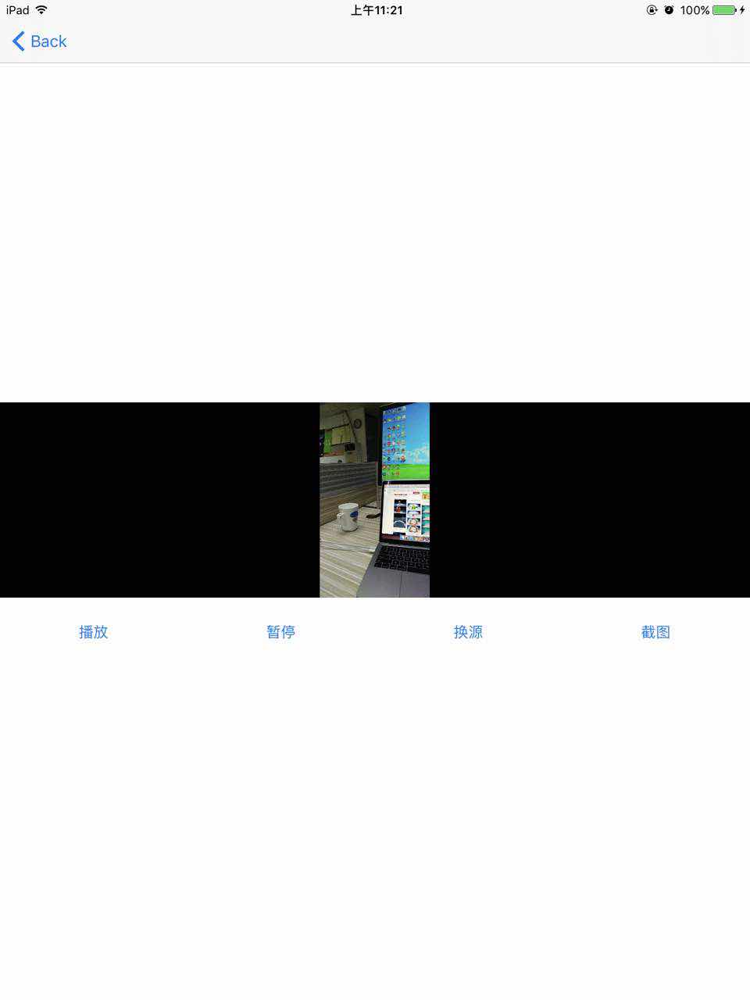

# ZHPlayer-Swift
ZHPlayer基于Swift语言，对AVPlayer进行封装的播放器。

## 新特性

* 兼容Swift4
* 可高度定制UI
* 简单易用

## 使用方法

1、初始化

```
let player = ZHPlayer()
player.url = URL(string: "xxxx")
或者
let player = ZHPlayer(url: <#T##URL#>)
```

2、添加播放器的view

```
contentView.addSubview(player.view)
player.view.fillToSuperview()
```

3、准备播放

```
player.prepareToPlay()
注意：切换播放的URL都需要调用prepareToPlay()方法才能播放
```

## 公开属性

```
/// 是否自动播放，默认true
public var shouldAutoplay: Bool = true
/// 播放器的状态
public var playbackState: PlaybackState = .stopped
/// 缓冲状态
public var bufferingState: BufferingState = .unknown 
/// 缓存的总时间
public var playableDuration: TimeInterval? 
/// 是否正在播放
public var isPlaying: Bool 
/// 是否静音
public var isMuted: Bool 
/// 音量调节
public var volume: Float 
/// 画面的尺寸
public var naturalSize: CGSize? 
/// 画面填充模式
public var fillMode: AVLayerVideoGravity 
/// 画面的背景颜色
public var layerBackgroundColor: UIColor = .black 
/// 当前时间点的截图
public var snapshotImage: UIImage? 

public func prepareToPlay() {...}
public func play() {...}    
public func pause() {...}
public func seek(to time: CMTime,completeHandler: (()->Void)? = nil) {...}

```

## 效果图




## 参考资料

* [Player](https://github.com/piemonte/Player)
* [Bilibili/ijkplayer](https://github.com/Bilibili/ijkplayer)
